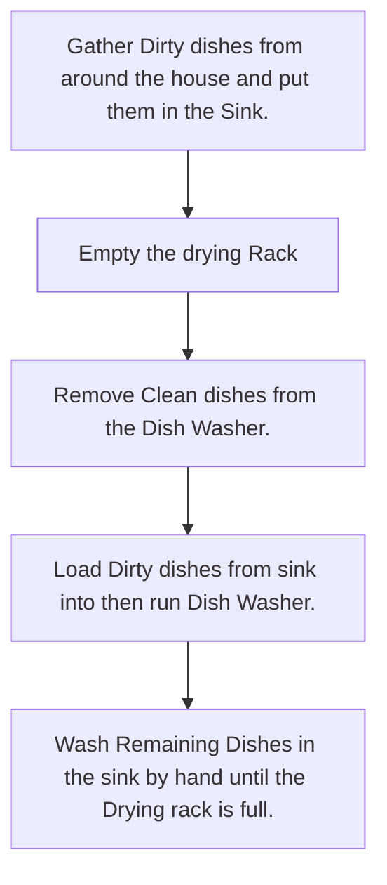

Item to Clean: General Dishes, Machine assisted, Single pass.

#Equipment  
| Item | Notes |  
| - | - |  
| Dirty Dishes |
| Dish Washer|
| Dish Rack|
| Dish washing Gloves | *Optional*
| Ear Defenders or ear plugs | *Optional*
| Dish Towel
| Sponge
| Soap

#Procedure  

#Variations  
*not yet Added*